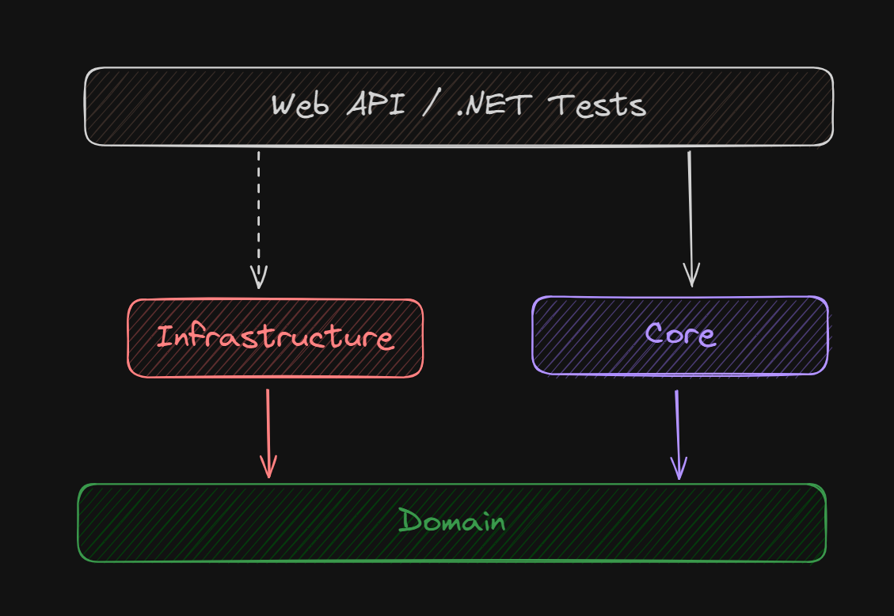

# About this API
This API was made using the Clean Architecture, which makes the Core project the dependecy of all the other layers, it has the entities, interfaces and
business logic.

Here is how the project is structured:

- **Domain Layer**: Contains the main models and interfaces used in the application (It does not depend on any layer since is used to hold the classes and interfaces).

- **Core Layer**: Contains the main services in the application and sets the business logic. (Depends only on the domain.)

- **Infrastructure Layer**: Handle anything that needs to deal with the database, implements the repositories, Unit Of Work and its own dependency injection configuration, which is done by and extension method used in the main Program.

- **Web API Layer**: Handle the endpoints, middlewares and anything that is closer to the client with DTOs or the models to pass only the needed data to the services. (Dependes on the domain and core layer, it also depends on the infrastructure layer only to make the dependency injection, but it does not use the repositories).

- **Tests Layer**: Layer specific to run unit tests on the core layer using Xunit, Shouldly and FakeItEasy (depends on the domain and core). 